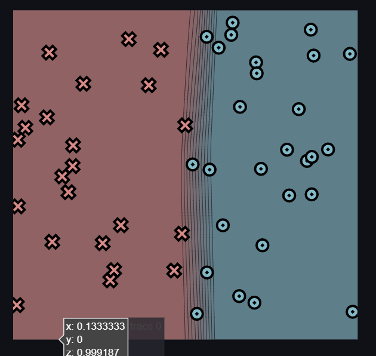
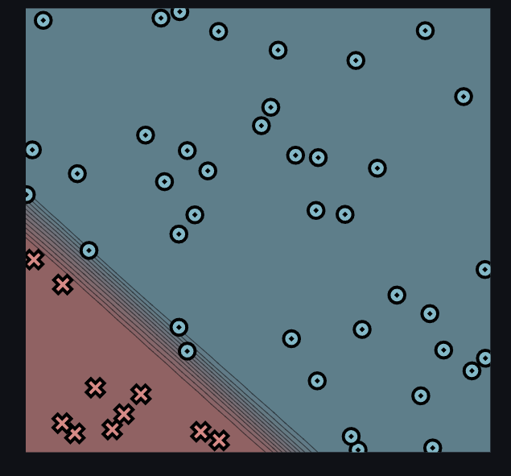
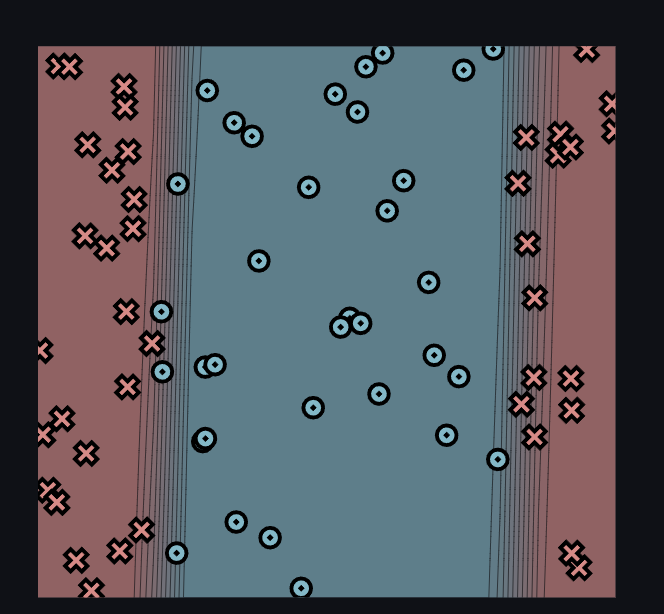
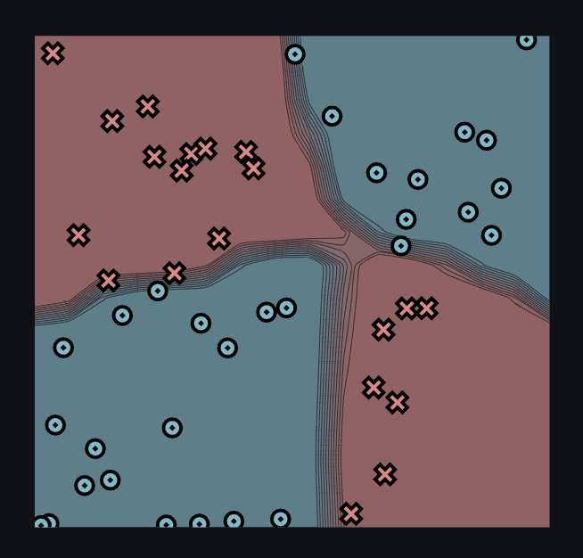

[](https://classroom.github.com/a/YFgwt0yY)
# MiniTorch Module 2


* Docs: https://minitorch.github.io/

* Overview: https://minitorch.github.io/module2/module2/


Simple:



Time per Epoch: 0.062 seconds

Final Loss: 2.77

Epochs: 550, Hidden: 4, Rate: 0.1

Epoch: 10/550, loss: 33.159016795033864, correct: 33
Epoch: 20/550, loss: 30.13828159845935, correct: 38
Epoch: 30/550, loss: 27.34279614887505, correct: 44
Epoch: 40/550, loss: 23.68438176811195, correct: 45
Epoch: 50/550, loss: 20.42893563803559, correct: 47
Epoch: 60/550, loss: 17.570711668475564, correct: 47
Epoch: 70/550, loss: 15.10315607735854, correct: 47
Epoch: 80/550, loss: 13.178846837962306, correct: 48
Epoch: 90/550, loss: 11.632076153082267, correct: 48
Epoch: 100/550, loss: 10.40461584238824, correct: 48
Epoch: 110/550, loss: 9.44292269419387, correct: 48
Epoch: 120/550, loss: 8.668719693253271, correct: 48
Epoch: 130/550, loss: 8.037626291028014, correct: 48
Epoch: 140/550, loss: 7.513378552548489, correct: 48
Epoch: 150/550, loss: 7.0720788606477205, correct: 48
Epoch: 160/550, loss: 6.69893763537318, correct: 48
Epoch: 170/550, loss: 6.375691315320406, correct: 48
Epoch: 180/550, loss: 6.091067965112808, correct: 48
Epoch: 190/550, loss: 5.838203549902526, correct: 48
Epoch: 200/550, loss: 5.611801117141973, correct: 48
Epoch: 210/550, loss: 5.4090068714112824, correct: 48
Epoch: 220/550, loss: 5.224826002840818, correct: 48
Epoch: 230/550, loss: 5.056911661453841, correct: 48
Epoch: 240/550, loss: 4.902550588709196, correct: 48
Epoch: 250/550, loss: 4.759873445024974, correct: 48
Epoch: 260/550, loss: 4.627498045691862, correct: 48
Epoch: 270/550, loss: 4.5041272437199, correct: 48
Epoch: 280/550, loss: 4.388731658312619, correct: 48
Epoch: 290/550, loss: 4.280404139480737, correct: 48
Epoch: 300/550, loss: 4.178400719749093, correct: 48
Epoch: 310/550, loss: 4.082128241271789, correct: 49
Epoch: 320/550, loss: 3.9937444537498545, correct: 49
Epoch: 330/550, loss: 3.912028926414576, correct: 49
Epoch: 340/550, loss: 3.834905098605103, correct: 49
Epoch: 350/550, loss: 3.761720907195573, correct: 49
Epoch: 360/550, loss: 3.6920249138708168, correct: 49
Epoch: 370/550, loss: 3.6254749081551907, correct: 49
Epoch: 380/550, loss: 3.562118232943826, correct: 49
Epoch: 390/550, loss: 3.5014232494796698, correct: 49
Epoch: 400/550, loss: 3.4430491816462707, correct: 49
Epoch: 410/550, loss: 3.386820757203264, correct: 49
Epoch: 420/550, loss: 3.332593487248397, correct: 49
Epoch: 430/550, loss: 3.2804846515777113, correct: 49
Epoch: 440/550, loss: 3.2301148472390917, correct: 50
Epoch: 450/550, loss: 3.1812991675022433, correct: 50
Epoch: 460/550, loss: 3.1344480343756453, correct: 50
Epoch: 470/550, loss: 3.089617653922807, correct: 50
Epoch: 480/550, loss: 3.0461531801706796, correct: 50
Epoch: 490/550, loss: 3.0039047653063093, correct: 50
Epoch: 500/550, loss: 2.9628311650300843, correct: 50
Epoch: 510/550, loss: 2.923582057557859, correct: 50
Epoch: 520/550, loss: 2.884691203541517, correct: 50
Epoch: 530/550, loss: 2.8476009514315175, correct: 50
Epoch: 540/550, loss: 2.8106116147608597, correct: 50
Epoch: 550/550, loss: 2.775464300315263, correct: 50


Diag:



Time per Epoch: 0.061 seconds

Epochs: 550, Hidden: 4, Rate: 0.1

Final Loss: 1.429

Epoch: 0/550, loss: 0, correct: 0
Epoch: 10/550, loss: 30.225174930574397, correct: 41
Epoch: 20/550, loss: 25.14670399431923, correct: 40
Epoch: 30/550, loss: 22.970538259095264, correct: 40
Epoch: 40/550, loss: 20.9201854198916, correct: 40
Epoch: 50/550, loss: 18.96798256192909, correct: 40
Epoch: 60/550, loss: 17.157867013973, correct: 41
Epoch: 70/550, loss: 15.415144794554378, correct: 44
Epoch: 80/550, loss: 13.80259729062241, correct: 46
Epoch: 90/550, loss: 12.313983323107166, correct: 48
Epoch: 100/550, loss: 10.981437197101004, correct: 48
Epoch: 110/550, loss: 9.816963184538771, correct: 48
Epoch: 120/550, loss: 8.818386276167244, correct: 48
Epoch: 130/550, loss: 7.972831899237214, correct: 48
Epoch: 140/550, loss: 7.262673483395163, correct: 48
Epoch: 150/550, loss: 6.663704947832525, correct: 49
Epoch: 160/550, loss: 6.156240524449356, correct: 49
Epoch: 170/550, loss: 5.722836900038062, correct: 50
Epoch: 180/550, loss: 5.348149557736057, correct: 50
Epoch: 190/550, loss: 5.021848692204046, correct: 50
Epoch: 200/550, loss: 4.734551009388177, correct: 50
Epoch: 210/550, loss: 4.478521620187093, correct: 50
Epoch: 220/550, loss: 4.234921319692554, correct: 50
Epoch: 230/550, loss: 4.0008830612254656, correct: 50
Epoch: 240/550, loss: 3.786098549087234, correct: 50
Epoch: 250/550, loss: 3.6110965526072247, correct: 50
Epoch: 260/550, loss: 3.4513822937527743, correct: 50
Epoch: 270/550, loss: 3.304547052141888, correct: 50
Epoch: 280/550, loss: 3.1689871796210105, correct: 50
Epoch: 290/550, loss: 3.04382644398399, correct: 50
Epoch: 300/550, loss: 2.927913386563224, correct: 50
Epoch: 310/550, loss: 2.819778862969641, correct: 50
Epoch: 320/550, loss: 2.7186210017421475, correct: 50
Epoch: 330/550, loss: 2.6238986079496605, correct: 50
Epoch: 340/550, loss: 2.535320092475408, correct: 50
Epoch: 350/550, loss: 2.4518938853684653, correct: 50
Epoch: 360/550, loss: 2.3729205335033643, correct: 50
Epoch: 370/550, loss: 2.2969347581132435, correct: 50
Epoch: 380/550, loss: 2.2252315993454594, correct: 50
Epoch: 390/550, loss: 2.158641964339946, correct: 50
Epoch: 400/550, loss: 2.0962004514796955, correct: 50
Epoch: 410/550, loss: 2.0371179652484988, correct: 50
Epoch: 420/550, loss: 1.9807075461164878, correct: 50
Epoch: 430/550, loss: 1.9268137665271001, correct: 50
Epoch: 440/550, loss: 1.8754852723361874, correct: 50
Epoch: 450/550, loss: 1.8266163132764495, correct: 50
Epoch: 460/550, loss: 1.7792772905425625, correct: 50
Epoch: 470/550, loss: 1.7338412611757876, correct: 50
Epoch: 480/550, loss: 1.6903001678595404, correct: 50
Epoch: 490/550, loss: 1.6484993713321088, correct: 50
Epoch: 500/550, loss: 1.608374869078313, correct: 50
Epoch: 510/550, loss: 1.5697337643024056, correct: 50
Epoch: 520/550, loss: 1.5325614539002221, correct: 50
Epoch: 530/550, loss: 1.496769867713473, correct: 50
Epoch: 540/550, loss: 1.462297206368723, correct: 50
Epoch: 550/550, loss: 1.4290027767052063, correct: 50


Split:



Time per Epoch: 0.271 seconds


Epochs: 750, Hidden: 9, Rate: 0.1


Epoch: 0/750, loss: 0, correct: 0
Epoch: 10/750, loss: 51.59518540443812, correct: 41
Epoch: 20/750, loss: 51.57247624100188, correct: 41
Epoch: 30/750, loss: 51.54741877700832, correct: 41
Epoch: 40/750, loss: 51.532033848743055, correct: 41
Epoch: 0/750, loss: 0, correct: 0
Epoch: 10/750, loss: 51.489724097866784, correct: 38
Epoch: 20/750, loss: 50.599941253784074, correct: 46
Epoch: 30/750, loss: 50.40972090177954, correct: 41
Epoch: 40/750, loss: 50.25553202525497, correct: 41
Epoch: 50/750, loss: 50.0939233128397, correct: 41
Epoch: 60/750, loss: 49.941722590732866, correct: 41
Epoch: 70/750, loss: 49.777750690312686, correct: 41
Epoch: 80/750, loss: 49.59709886049584, correct: 41
Epoch: 90/750, loss: 49.40274912501668, correct: 41
Epoch: 100/750, loss: 49.217639530053475, correct: 41
Epoch: 110/750, loss: 49.020819172470766, correct: 41
Epoch: 120/750, loss: 48.81245532736848, correct: 41
Epoch: 130/750, loss: 48.604232563843404, correct: 41
Epoch: 140/750, loss: 48.392434513114594, correct: 46
Epoch: 150/750, loss: 48.171481136683774, correct: 46
Epoch: 160/750, loss: 47.955115048560266, correct: 46
Epoch: 170/750, loss: 47.74063336182191, correct: 48
Epoch: 180/750, loss: 47.527801168231505, correct: 48
Epoch: 190/750, loss: 47.30933962638255, correct: 48
Epoch: 200/750, loss: 47.09007599994572, correct: 48
Epoch: 210/750, loss: 46.854689257931106, correct: 48
Epoch: 220/750, loss: 46.614686902093304, correct: 48
Epoch: 230/750, loss: 46.37085437719737, correct: 48
Epoch: 240/750, loss: 46.111006220673815, correct: 48
Epoch: 250/750, loss: 45.827007618391036, correct: 48
Epoch: 260/750, loss: 45.54339429161921, correct: 48
Epoch: 270/750, loss: 45.19259090500874, correct: 48
Epoch: 280/750, loss: 44.7870064337558, correct: 49
Epoch: 290/750, loss: 44.21436032090295, correct: 51
Epoch: 300/750, loss: 43.39164676246711, correct: 50
Epoch: 310/750, loss: 42.59812955501195, correct: 51
Epoch: 320/750, loss: 41.73711964817242, correct: 52
Epoch: 330/750, loss: 40.797270684481255, correct: 53
Epoch: 340/750, loss: 39.76347400649757, correct: 56
Epoch: 350/750, loss: 38.63675102146982, correct: 59
Epoch: 360/750, loss: 37.395089168493634, correct: 62
Epoch: 370/750, loss: 36.037559245385616, correct: 64
Epoch: 380/750, loss: 34.573373447554815, correct: 65
Epoch: 390/750, loss: 33.06548681596468, correct: 66
Epoch: 400/750, loss: 31.628515695409305, correct: 66
Epoch: 410/750, loss: 30.208136331502615, correct: 67
Epoch: 420/750, loss: 28.800283050756146, correct: 70
Epoch: 430/750, loss: 27.400931493241718, correct: 70
Epoch: 440/750, loss: 26.03766748735352, correct: 70
Epoch: 450/750, loss: 24.73659142662139, correct: 70
Epoch: 460/750, loss: 23.51617265892133, correct: 70
Epoch: 470/750, loss: 22.373548933736924, correct: 71
Epoch: 480/750, loss: 21.29569898937874, correct: 71
Epoch: 490/750, loss: 20.274266007965704, correct: 71
Epoch: 500/750, loss: 19.316494533227186, correct: 71
Epoch: 510/750, loss: 18.43451156013204, correct: 72
Epoch: 520/750, loss: 17.607098851524068, correct: 72
Epoch: 530/750, loss: 16.837242609807348, correct: 72
Epoch: 540/750, loss: 16.11721378830001, correct: 72
Epoch: 550/750, loss: 15.445488063908186, correct: 72
Epoch: 560/750, loss: 14.825024437885423, correct: 72
Epoch: 570/750, loss: 14.245600020547549, correct: 72
Epoch: 580/750, loss: 13.706348820078546, correct: 72
Epoch: 590/750, loss: 13.204622352280039, correct: 72
Epoch: 600/750, loss: 12.737429093416454, correct: 72
Epoch: 610/750, loss: 12.308092875544625, correct: 72
Epoch: 620/750, loss: 11.905925731752104, correct: 72
Epoch: 630/750, loss: 11.528604087958037, correct: 73
Epoch: 640/750, loss: 11.17505493683255, correct: 73
Epoch: 650/750, loss: 10.842995216718222, correct: 73
Epoch: 660/750, loss: 10.53047062887187, correct: 73
Epoch: 670/750, loss: 10.235782768457916, correct: 73
Epoch: 680/750, loss: 9.958376314569914, correct: 73
Epoch: 690/750, loss: 9.696482179970223, correct: 73
Epoch: 700/750, loss: 9.449303631351428, correct: 73
Epoch: 710/750, loss: 9.215139215304127, correct: 73
Epoch: 720/750, loss: 8.993017992133973, correct: 73
Epoch: 730/750, loss: 8.78209350541775, correct: 73
Epoch: 740/750, loss: 8.582683334378588, correct: 74
Epoch: 750/750, loss: 8.39339581629155, correct: 74


XOR:



Time per Epoch: 0.264 seconds


Epochs: 1150, Hidden: 11, Rate: 0.5


Epoch: 0/1150, loss: 0, correct: 0
Epoch: 10/1150, loss: 31.5494182165519, correct: 32
Epoch: 20/1150, loss: 30.287454540223003, correct: 37
Epoch: 30/1150, loss: 30.79311310396678, correct: 31
Epoch: 40/1150, loss: 28.185647775446412, correct: 35
Epoch: 50/1150, loss: 28.805516058209736, correct: 32
Epoch: 60/1150, loss: 24.840189377241355, correct: 37
Epoch: 70/1150, loss: 25.325077977999467, correct: 35
Epoch: 80/1150, loss: 21.97348075560514, correct: 37
Epoch: 90/1150, loss: 22.76086209194681, correct: 37
Epoch: 100/1150, loss: 19.302349685400472, correct: 38
Epoch: 110/1150, loss: 20.501301935700855, correct: 38
Epoch: 120/1150, loss: 17.382967017769904, correct: 40
Epoch: 130/1150, loss: 19.357008449373982, correct: 39
Epoch: 140/1150, loss: 15.58399073294524, correct: 43
Epoch: 150/1150, loss: 16.934730597468228, correct: 39
Epoch: 160/1150, loss: 14.989728883321483, correct: 42
Epoch: 170/1150, loss: 15.736843682836458, correct: 40
Epoch: 180/1150, loss: 12.58386460648727, correct: 44
Epoch: 190/1150, loss: 15.6252911539401, correct: 41
Epoch: 200/1150, loss: 11.468570637211675, correct: 46
Epoch: 210/1150, loss: 12.060844076671662, correct: 45
Epoch: 220/1150, loss: 12.210536555861912, correct: 44
Epoch: 230/1150, loss: 12.737028570238868, correct: 43
Epoch: 240/1150, loss: 12.407092859254602, correct: 45
Epoch: 250/1150, loss: 13.118079632439857, correct: 44
Epoch: 260/1150, loss: 10.674742451854549, correct: 46
Epoch: 270/1150, loss: 10.549336520984413, correct: 46
Epoch: 280/1150, loss: 8.617205739160887, correct: 47
Epoch: 290/1150, loss: 9.133417567116176, correct: 46
Epoch: 300/1150, loss: 7.849474317949951, correct: 47
Epoch: 310/1150, loss: 29.54215255936592, correct: 38
Epoch: 320/1150, loss: 5.28006647048613, correct: 50
Epoch: 330/1150, loss: 4.580835624464207, correct: 50
Epoch: 340/1150, loss: 4.891077911097078, correct: 48
Epoch: 350/1150, loss: 15.021483675110394, correct: 41
Epoch: 360/1150, loss: 4.473729137561113, correct: 50
Epoch: 370/1150, loss: 3.8109881339516978, correct: 50
Epoch: 380/1150, loss: 3.485650673321773, correct: 50
Epoch: 390/1150, loss: 4.476604508560107, correct: 48
Epoch: 400/1150, loss: 6.167142249323542, correct: 48
Epoch: 410/1150, loss: 3.513892110802426, correct: 50
Epoch: 420/1150, loss: 3.0546500640910255, correct: 50
Epoch: 430/1150, loss: 2.750375829109044, correct: 50
Epoch: 440/1150, loss: 2.525573678353738, correct: 50
Epoch: 450/1150, loss: 2.4280218323323424, correct: 50
Epoch: 460/1150, loss: 22.855326917520728, correct: 43
Epoch: 470/1150, loss: 3.394883275437717, correct: 49
Epoch: 480/1150, loss: 2.768979746628892, correct: 50
Epoch: 490/1150, loss: 3.328117607005965, correct: 48
Epoch: 500/1150, loss: 4.119948138397148, correct: 48
Epoch: 510/1150, loss: 5.002100764643478, correct: 48
Epoch: 520/1150, loss: 4.221779529319359, correct: 48
Epoch: 530/1150, loss: 3.0825797003677162, correct: 48
Epoch: 540/1150, loss: 2.8318795423602454, correct: 48
Epoch: 550/1150, loss: 2.783223829522038, correct: 48
Epoch: 560/1150, loss: 3.35277881631988, correct: 48
Epoch: 570/1150, loss: 3.278431688858535, correct: 48
Epoch: 580/1150, loss: 2.826314509948774, correct: 48
Epoch: 590/1150, loss: 2.5494156817884988, correct: 48
Epoch: 600/1150, loss: 2.4642668108040864, correct: 48
Epoch: 610/1150, loss: 2.6156055071906814, correct: 48
Epoch: 620/1150, loss: 2.517923491181787, correct: 48
Epoch: 630/1150, loss: 2.442392129707327, correct: 48
Epoch: 640/1150, loss: 2.3775730285014207, correct: 48
Epoch: 650/1150, loss: 2.288092749276311, correct: 48
Epoch: 660/1150, loss: 2.4126399386142547, correct: 48
Epoch: 670/1150, loss: 2.352893384845568, correct: 48
Epoch: 680/1150, loss: 2.2749151160790055, correct: 48
Epoch: 690/1150, loss: 2.1242831103098117, correct: 48
Epoch: 700/1150, loss: 2.0341968917608324, correct: 49
Epoch: 710/1150, loss: 2.239814698974989, correct: 48
Epoch: 720/1150, loss: 2.1381347666764627, correct: 48
Epoch: 730/1150, loss: 2.120424778575829, correct: 48
Epoch: 740/1150, loss: 2.038366923126458, correct: 49
Epoch: 750/1150, loss: 1.9296355166361847, correct: 49
Epoch: 760/1150, loss: 1.8495770565993201, correct: 49
Epoch: 770/1150, loss: 1.816682447202589, correct: 49
Epoch: 780/1150, loss: 1.777460301068491, correct: 49
Epoch: 790/1150, loss: 1.9298560048029054, correct: 49
Epoch: 800/1150, loss: 1.886194034717219, correct: 49
Epoch: 810/1150, loss: 1.8621131893383789, correct: 49
Epoch: 820/1150, loss: 1.8169801485014512, correct: 49
Epoch: 830/1150, loss: 1.8448893044072139, correct: 49
Epoch: 840/1150, loss: 1.856374855279891, correct: 49
Epoch: 850/1150, loss: 1.824034499161565, correct: 49
Epoch: 860/1150, loss: 1.7052407451280691, correct: 49
Epoch: 870/1150, loss: 1.720903367268649, correct: 49
Epoch: 880/1150, loss: 1.7225356607525153, correct: 49
Epoch: 890/1150, loss: 1.7219338515719893, correct: 49
Epoch: 900/1150, loss: 1.6836399147491046, correct: 49
Epoch: 910/1150, loss: 1.6637477134622536, correct: 49
Epoch: 920/1150, loss: 1.6237647134568631, correct: 49
Epoch: 930/1150, loss: 1.594171232523794, correct: 49
Epoch: 940/1150, loss: 1.5594576210328088, correct: 49
Epoch: 950/1150, loss: 1.3772436785515998, correct: 49
Epoch: 960/1150, loss: 1.3783564319330655, correct: 49
Epoch: 970/1150, loss: 1.3569908788260021, correct: 49
Epoch: 980/1150, loss: 1.3361130494907616, correct: 49
Epoch: 990/1150, loss: 1.3163608065709562, correct: 49
Epoch: 1000/1150, loss: 1.32353474203288, correct: 49
Epoch: 1010/1150, loss: 1.346820754006138, correct: 49
Epoch: 1020/1150, loss: 1.3366140052767925, correct: 49
Epoch: 1030/1150, loss: 1.338045964492011, correct: 49
Epoch: 1040/1150, loss: 1.3996877873213056, correct: 49
Epoch: 1050/1150, loss: 1.2222812645073464, correct: 49
Epoch: 1060/1150, loss: 1.2216723966824947, correct: 49
Epoch: 1070/1150, loss: 1.2338506028171479, correct: 49
Epoch: 1080/1150, loss: 1.2884364113367006, correct: 49
Epoch: 1090/1150, loss: 1.3516758553943442, correct: 49
Epoch: 1100/1150, loss: 1.168295215887523, correct: 49
Epoch: 1110/1150, loss: 1.204229956357999, correct: 49
Epoch: 1120/1150, loss: 1.2497689957030746, correct: 49
Epoch: 1130/1150, loss: 1.1234841736709615, correct: 49
Epoch: 1140/1150, loss: 1.1553699740477865, correct: 49
Epoch: 1150/1150, loss: 1.210612425771178, correct: 49


This assignment requires the following files from the previous assignments. You can get these by running

```bash
python sync_previous_module.py previous-module-dir current-module-dir
```

The files that will be synced are:

        minitorch/operators.py minitorch/module.py minitorch/autodiff.py minitorch/scalar.py minitorch/scalar_functions.py minitorch/module.py project/run_manual.py project/run_scalar.py project/datasets.py